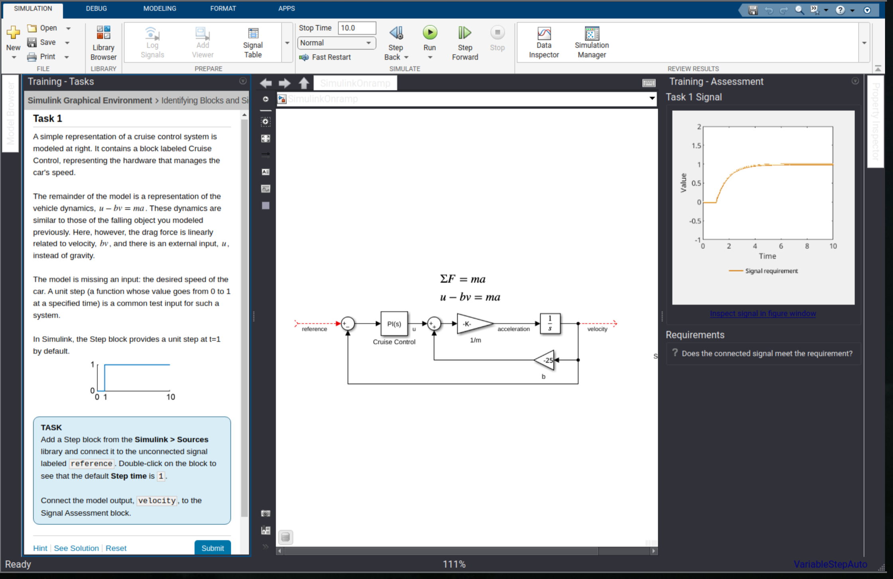
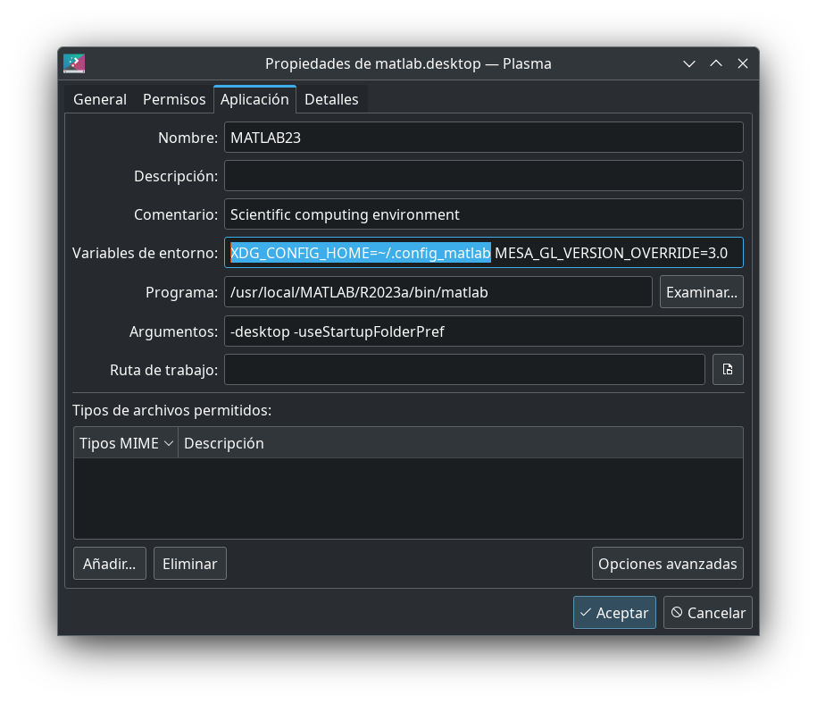
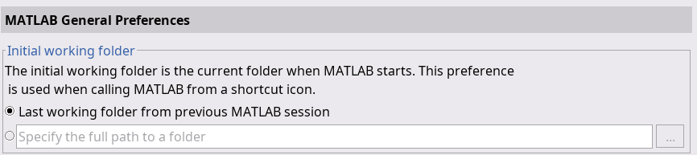

# Dark theme problems with MATLAB/Simulink
> Tested with _Debian Trixie_ GNU/Linux / KDE/Plasma / MATLAB 2013a. 

#### Error:
Simulink has a broken color scheme when using dark theme in Linux.



#### Solution:
Simulink uses some Qt libraries, so some configurations can be changed with environment variables. Theme preferences are
defined in the ~/.config folder, thus simple steps can be followed to use MATLAB with its default light theme and system dark theme (using KDE). 

1. Close any MATLAB instance
2. Select a light theme, i.e.
```bash
plasma-apply-colorscheme BreezeClassic
```
3. Make a copy of the .config folder
```bash
cp ~/.config ~/.config_matlab
```
4. Return back to your preferred dark theme
```bash
plasma-apply-colorscheme BreezeDark
```
5. Start MATLAB with the modified .config folder and test.
```bash
export XDG_CONFIG_HOME=~/.config_matlab; matlab
```
6. Configure the desktop MATLAB launcher


_More info: https://la.mathworks.com/matlabcentral/answers/1848238-simulink-has-broken-color-scheme_

# Can't run MATLAB 2022a/2023a installer

> Tested with _Debian 12 (Bookworm)_ GNU/Linux  

#### Error:
```bash
what():  Failed to launch web window with error: Unable to launch the MATLABWindow application. The exit code was: 127
```

#### Solution:

```bash
cd (extracted_iso_path)/bin/glnxa64
mkdir exclude
mv libfreetype.so* exclude/
```

# Error when loading any plot

#### Error:
```bash
`com.jogamp.opengl.GLException: X11GLXDrawableFactory`
```

#### Solution:
```
nano (intall_dir)/bin/glnxa64/java.opts
```
Paste `-Djogl.disable.openglarbcontext=1` inside the text file.

# Simulink error "Failed to load bundle..."
#### Error
```bash
Failed to load bundle #429: .../R2022a/bin/glnxa64/libmwsl_graphical_classes.so
```

#### Solution:
```bash
cd (install_dir)/bin/glnxa64
mkdir exclude 
mv libfreetype.so.6* exclude/
```

# MATLAB startup doesn't respect default folder settings

#### Problem
Default folder settings is not respected



#### Solution
Start MATLAB with the following parameter:
```bash
-useStartupFolderPref
```
 
